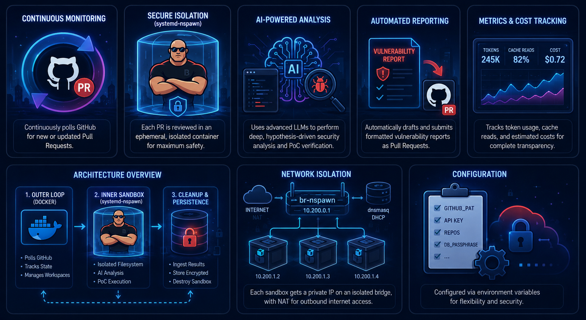

<div align="center"></div>

# Bouncer
Bouncer is an automated, continuous security review tool that monitors GitHub Pull Requests for vulnerabilities. It runs inside a Docker container, periodically polling configured repositories. Using AI (`opencode-ai` + OpenRouter), it strictly analyzes new PR diffs to discover critical security vulnerabilities and attempts to verify them. 

If a serious vulnerability is confirmed with a working Proof of Concept (PoC), Bouncer automatically drafts a formatted security report and opens a pull request directly to your designated private security repository.

<div align="center"></div>

## Features
- **Continuous Monitoring:** Runs in a continuous loop to check for new or updated PRs.
- **Secure Isolation (systemd-nspawn):** Safely isolates each PR review and its AI agent inside a nested, ephemeral `systemd-nspawn` container, allowing the AI to execute arbitrary test code and PoCs safely.
- **State Tracking:** Remembers previously scanned commits to avoid redundant work.
- **AI-Powered Analysis:** Leverages LLMs to perform hypothesis-driven code review and exploit construction.
- **Metrics & Cost Tracking:** Automatically extracts LLM token usage, cache reads, and estimated costs for each PR review.
- **Automated Reporting:** Submits actionable, formatted vulnerability reports directly to a private GitHub repo. Reports that declare no finding (`finding: false` in the frontmatter — clean PRs) are discarded at ingestion, never stored.

## Architecture

Bouncer operates with a nested sandbox approach for maximum safety and modularity:
1. **Outer Loop (Docker):** The main Bouncer application runs as a privileged Docker container. It polls GitHub for open PRs, maintains an encrypted database of reviewed hashes, and checks out PR branches into isolated workspace directories.
2. **Inner Sandbox (systemd-nspawn):** For each PR, Bouncer provisions a temporary, disposable filesystem snapshot (using `cp -a` from a cached base clone) and injects a customizable prompt (`prompt_template.txt` from `templates/`) alongside an execution script (`opencode_runner.sh` from `scripts/`). It then launches an ephemeral `systemd-nspawn` container specifically for that single PR review. 
3. **Network Isolation:** To prevent port collisions and ensure test fidelity across concurrently running instances (e.g., if multiple AI reviewers try to spin up a server on port `8080`), Bouncer establishes a dedicated virtual bridge (`br-nspawn`) in the host container. Every `systemd-nspawn` instance boots into an isolated network namespace attached to this bridge, obtaining a private `10.200.x.x` IP via `dnsmasq`'s DHCP server, while still utilizing NAT to maintain outgoing internet access.
4. **Cleanup & Persistence:** Once the LLM finishes verifying its hypothesis or building a PoC, the ephemeral nspawn container is immediately destroyed. Generated vulnerability reports and cost metrics are securely ingested into an encrypted SQLCipher database residing in the `/out` volume.

## Nested Container Network Configuration

To provide the AI with a realistic test environment while maintaining safety and allowing concurrency, Bouncer explicitly configures an isolated networking stack for all spawned PR review sandboxes. 

The configuration involves several foundational steps executed by Bouncer's `entrypoint.sh` when the main Docker container starts:

1. **Virtual Bridge Creation (`br-nspawn`):** Bouncer creates a virtual network bridge interface named `br-nspawn` inside the main Docker container. This acts as a virtual switch to connect the nested sandboxes.
2. **Subnet Allocation:** The bridge is assigned the gateway IP address `10.200.0.1` and manages the `10.200.0.0/16` local subnet.
3. **NAT and Packet Forwarding:** To allow outbound internet access from inside the sandboxes (e.g., so the AI can download code dependencies via `npm`, `pip`, or `cargo`), Bouncer enables IPv4 packet forwarding in the kernel (`/proc/sys/net/ipv4/ip_forward`) and adds an `iptables` POSTROUTING masquerade rule for the `10.200.0.0/16` subnet. This translates the internal nested IPs to the main Docker container's IP when reaching out to the internet.
4. **DHCP Server (`dnsmasq`):** A lightweight `dnsmasq` daemon is launched, bound specifically to the `br-nspawn` interface. It provides dynamic DHCP leases in the range `10.200.0.2` to `10.200.255.254` to any container attaching to the bridge.
5. **Namespace Attachment:** When a new `systemd-nspawn` sandbox is launched to review a PR, it is initiated with the `--network-bridge=br-nspawn` flag. This creates a virtual ethernet (`veth`) pair, connecting the new container's isolated network namespace directly to the `br-nspawn` bridge, allowing it to request its own private IP address via DHCP.

**Why is this important?** 
Because each `systemd-nspawn` sandbox boots into its own fully isolated network namespace with its own IP and loopback interface (`localhost`), concurrent reviews never experience port conflicts. Multiple distinct PR review agents can safely spin up services on identical ports (like `0.0.0.0:8080`) at the exact same time without interfering with the host or with each other.

## Configuration

Bouncer is configured using environment variables. Create a `.env` file in the project root or configure them directly in `docker-compose.yml`.

### Required Variables
- `GITHUB_PAT` (or `GITHUB_TOKEN`): A GitHub Personal Access Token. Needs read access to the target `REPOS` and read/write access to the `REPORT_REPO`.
- **At least one API key** for LLM access:
  - `OPENROUTER_API_KEY`
  - `OPENAI_API_KEY`
  - `ANTHROPIC_API_KEY`
  - `GOOGLE_API_KEY`
  - `KIMI_API_KEY` (Kimi for Coding plan key; pair with `OPENCODE_MODEL=kimi-for-coding/k3` or another model from that provider)
- `REPOS`: A comma-separated list of target repositories to monitor (e.g., `org/repo1,org/repo2`).
- `DB_PASSPHRASE`: A strong passphrase to encrypt the local SQLite (SQLCipher) database containing PR state tracking and generated vulnerability reports. This is strictly required and does not have a default.

### Optional Variables
- `REPORT_REPO`: The private repository where security findings will be submitted as PRs. **Optional** — when unset or empty, Bouncer runs in **local-only reporting mode**: all findings (including confirmed, PoC-backed ones) are stored only in the encrypted local database, and the AI agents are explicitly instructed not to open PRs, push branches, or comment anywhere. (If you use `docker-compose.yml`, remove or empty the `REPORT_REPO` line there for local-only mode.)
- `OPENCODE_MODEL`: The AI model to use (default: `openrouter/google/gemini-3.1-pro-preview`).
- `SLEEP_DURATION`: Time in seconds to sleep between review cycles (default: `60`).
- `REVIEW_TIMEOUT`: Maximum execution time for a single PR review before it is forcibly killed. Accepts standard `timeout` command formats like "6h", "30m" (default: `30m`).
- `DASHBOARD_TOKEN`: Optional bearer token protecting the report dashboard. Strongly recommended — the dashboard exposes full vulnerability reports. When unset, the dashboard is unauthenticated and should only be bound to localhost.
- `PR_MAX_AGE`: How far back to look for active PRs. Supports `date` tool formats like "4 months", "30 days", "1 year" (default: `4 months`).
- `SKIP_PRS`: A comma-separated list of PRs to explicitly ignore, formatted as `org/repo#pr` (e.g., `myorg/repo1#139,myorg/repo2#42`).
- `ALLOWED_AUTHOR_ASSOCIATIONS`: A comma-separated list of GitHub author associations allowed to trigger reviews. This acts as a configurable security feature to prevent execution on PRs from unknown users (default: `COLLABORATOR,CONTRIBUTOR,MEMBER,OWNER`).
- `MAX_WORKER`: Maximum number of PR reviews to run concurrently per cycle. `0` (default) means unlimited — every eligible PR is launched in parallel. When set to a positive integer, the review loop blocks until a slot frees up before launching another review, capping resource usage on hosts with limited CPU/memory.
- `FINDINGS_BUDGET`: Maximum number of entries kept in the carry-forward findings ledger used by backfill mode (default: `10`). When exceeded, the least important findings (lowest severity, `theoretical` before `confirmed`, oldest first) are evicted.
- `BACKFILL_ENFORCE_AUTHOR`: Set to `1` to apply the `ALLOWED_AUTHOR_ASSOCIATIONS` filter in backfill mode. Backfill skips this filter by default because it reviews maintainer-merged historical PRs, whose authors often show a `NONE` association today.

## Usage

1. Clone this repository.
2. Set your environment variables in a `.env` file at the root of the project:
   ```env
    GITHUB_PAT=ghp_your_token_here
    # Provide at least one API key
    OPENROUTER_API_KEY=sk-or-v1-your_key_here
    # OPENAI_API_KEY=sk-...
    REPOS=myorg/myrepo1,myorg/myrepo2
    REPORT_REPO=myorg/private-security-audits

   ```
3. Start the service using Docker Compose (*Note: The Docker container must run in `privileged` mode to support namespace allocation and nested `systemd-nspawn` containers*):
   ```bash
   docker compose up -d
   ```

### Reviewing a Specific PR Manually
You can run an isolated review on a specific PR without waiting for or affecting the continuous background polling loop. Use `docker compose run` to spawn a temporary container that performs the review and exits:
```bash
docker compose run --rm bouncer /app/scripts/review_pr.sh myorg/myrepo 42
```

### Historical Backfill Mode (Chained Whole-Repo Scan)
Backfill mode scans a whole repository by reviewing every **merged** PR sequentially, from the beginning of its history (or a start point in the past) up to the latest merged PR. Each review runs in the same isolated `systemd-nspawn` sandbox as continuous mode, but reviews are **chained**: a findings ledger is carried forward from one PR to the next, so the agent knows which vulnerabilities were already discovered, avoids duplicates, and notices when a later PR fixes an earlier finding. The ledger is bounded by `FINDINGS_BUDGET` — when it grows past the budget, the least important findings are evicted.

```bash
# Scan every merged PR from the beginning of the repo's history
docker compose run --rm bouncer /app/scripts/backfill.sh myorg/myrepo

# Scan a range — bounds accept a PR number or a date (YYYY-MM-DD)
docker compose run --rm bouncer /app/scripts/backfill.sh myorg/myrepo 100 500
docker compose run --rm bouncer /app/scripts/backfill.sh myorg/myrepo 2023-01-01
```

Backfill is **resumable**: reviewed PRs are recorded in the encrypted database, so re-running the same command after an interruption continues where it stopped. Reports and metrics are ingested into the database exactly as in continuous mode, and confirmed PoC-backed findings are submitted as PRs to `REPORT_REPO` when it is configured (otherwise they stay local-only). When a later PR fixes, invalidates, or disproves a finding whose report was already submitted, the verifier closes the now-stale report PR in `REPORT_REPO` with a comment referencing the resolving PR (remote mode only; entries dropped by budget eviction are left alone, since those findings still stand). In **both** modes the original report in the local database is marked as resolved (`resolved_by_pr`, `resolved_reason`, `resolved_at` on `pr_reports`), so the resolution lifecycle is tracked even without a report repository. Note that a full-history scan is a long, cost-intensive operation — narrow the range or lower the budget as needed.

## Logs and Output

- **Logs:** View the process using `docker logs -f bouncer`. In addition to execution details, token usage and cost metrics will be printed to stdout after every run.
- **Persistence Database:** State tracking, raw LLM metrics, and the full text of any generated vulnerability reports are stored in an AES-256 encrypted SQLCipher database permanently saved to the local `./out/bouncer.db` volume. Use the provided `DB_PASSPHRASE` to decrypt and access this file manually if required.

## Report Dashboard

A read-only web dashboard (`dashboard/`) decrypts and displays the reports stored in the encrypted database: findings with severity/status badges (parsed from the report frontmatter), token/cost metrics per review, full markdown rendering, one-click extraction of any report as a `.md` file, and the backfill findings ledgers.

Start it alongside the main service:

```bash
docker compose up -d dashboard
# open http://localhost:5001
```

It uses the same `DB_PASSPHRASE` as the bouncer service and reads the same `./out` volume — the database is never modified. Set `DASHBOARD_TOKEN` to require a bearer token (the UI will prompt for it), and `DASHBOARD_PORT` to change the host port (default: `5001`).

You can also run it directly on the host (requires `python3` and the `sqlcipher` CLI):

```bash
DB_PASSPHRASE=your_key DB_PATH=./out/bouncer.db python3 dashboard/app.py
```
